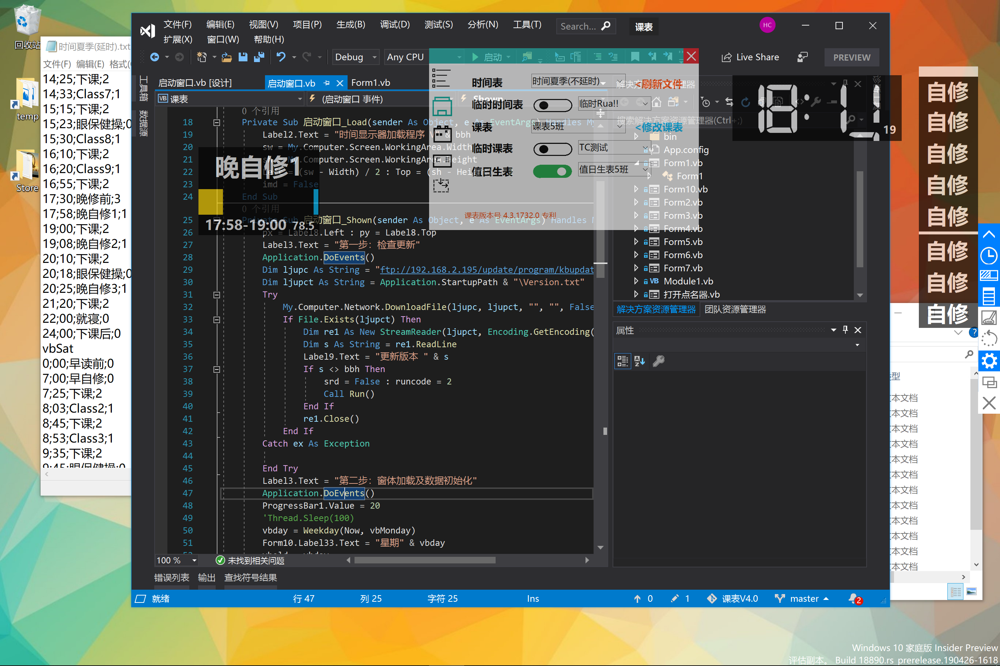

# classtable-version4.0

&emsp;&emsp;课表4，是我高中时候早期的程序作品，最终代码量超10000行，前后更新将近1年，然而风云不测，当时没有将源代码上传到`github`，硬盘保留的存档也消失了，我在QQ空间一年前的回忆中还有些许影子。今天，我的高中同学给了我封存了将近快1年的程序，我感到非常高兴——这是我第一次写小型项目。
 &emsp;&emsp;很庆幸，更新日志都还在，数据也都还在，在高二到高三将近2年的岁月，我的软件基本上每天都在教室的一体机上跑着，当然，到了快毕业的时候，`TimeMix`横空出世，我的软件从此便只成了回忆。`课表4`，是我青春的一个记忆。
 &emsp;&emsp;希望大家尽情阅读我的代码(看看我当年写的代码有多渣)，更新是不可能再更新了(但是可能会修复一些小bug，写点花絮什么的)，也可以`clone`并亲自在你的电脑上一睹风采(保准纯净没有病毒)。

#### 更新日志

> 该部分依据保存的历史记录编写。

- **version 1.0** &emsp; `2016/3-2016/6`

1. 采用vb6.0创作，早已不使用，当时开创的进度条核心语句现在仍在使用。
2. 曾经拥有的二维沙漏也早已不复存在。
3. 当时课表，进度条 与 时间显示器是分离开的。

> *花絮：* 该版本是用vb6开发的，属于另外一个已经消失的项目

- **version 2.0** &emsp; `2016/7/8`

1. 采用vb.net创作a加入了贴靠在右边的主界面，可以收缩和展开。
2. 将独立的时间显示器加入到此程序中。
3. 进度条中文字和进度分离开。
4. 首次加入变色模式(课程进度显示条)。
5. 加入值日生表系统。
6. 首次加入窗体布局功能，可以确定初始加载的位置。

- **version 3.1(创意者更新)** &emsp; `2017/5/4`

1. 主界面可以自由移动了，既可以贴靠在左边，又可以贴靠在右边。
2. 进度的变色模式可以自己自由选择(0-不变色，1-变色普通，2-变色平滑)。
3. 全面优化设置界面。
    - 加入开机启动功能。
    - 加入窗体缩放[核心代码请联系开发人员]。
    - 加入定时置顶功能。
    - 值日生表降级，成为非必需加载项。
    - 支持临时时间表，临时课表，从原来的自由加载改为了限定加载[开头必须符合命名要求，格式也必须符合要求]。
    - 支持点名器外部程序，现在已将其移入内置界面。
    - 加入上课重排功能。

> *花絮：* 时间显示器以前有一个用vb6写的版本，是单独的，后来合并到此软件。

- **version 3.2**

    - *subversion 1004.1-1004.6* &emsp; `2017/6/5`

    1. 优化内部窗体宽度的计算方法。
    2. 修复了高DPI下系统缩放导致的窗体模糊问题[需要修改兼容模式为应用程序]
    3. 增加了修改版本号的功能，并可以显示。[纯属娱乐]
    4. 窗口缩放从原来的50-300%[最小调整距离10%]调整为40-200%[最小调整距离5%]。
    5. 窗口缩放添加了存储功能，重新加载可以自动调整缩放比例。
    6. 修复了修改点名器时间(每天弹开的时间显示错误)的问题。
    7. 加入了调整系统时间的功能。

    - *subversion 1004.7* &emsp; `2017/6/6`

    1. 修复了课表宽度显示的问题[新问题].

- **version 3.3**

    - *subversion 1537.0-1537.1* `2017/6/6`

    1. 修复了窗体布局界面无法窗口贴靠的问题。
    2. 对设置的一些项目进行了调整(将上课模式[下个大版本更新]移动到辅助功能栏，将上课重排移动到常用，将点名器移动到外部程序)。
    3. 修复了隐藏的点名器路径设置错误的问题。
    4. 修复了窗口缩放默认显示为40%[实际为100%]的问题。

    - *subversion 1537.2-1537.3* `2017/6/7`

    1. 久违的帮助界面已经完成，尽情享用吧。
    1. 将点名器的打开时间拓展到七天全部
    2. 优化将无效项用灰色表示

- **version 4.1**

1. 加入了自动切换值日生表的系统。
2. 加入自动更新系统。
3. 新建时间表，与考试时间有关，可以到ftp下载。
[时间[考试]，课表[考试]需要自己修改]

#### 感谢

[QHT](https://github.com/117503445/):帮我找回了源代码。并提供了一系列的技术支持。